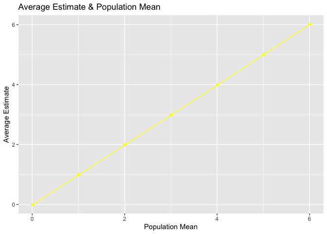
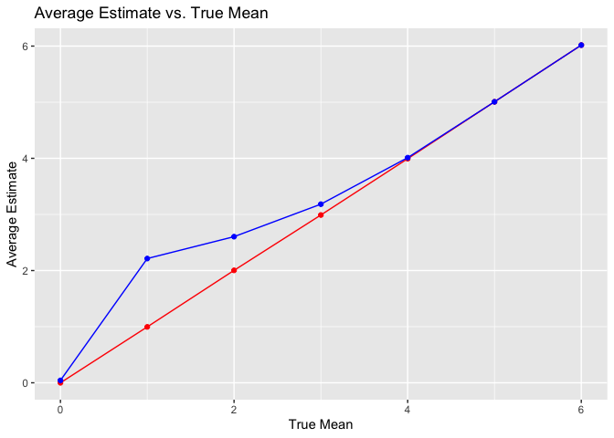

p8105_hw5_yz4717
================
Yang Zhao - yz4717
2023-11-12

- [Problem 1](#problem-1)
  - [Question 2](#question-2)
  - [Question 3](#question-3)

``` r
library(tidyverse)
```

    ## ── Attaching core tidyverse packages ──────────────────────── tidyverse 2.0.0 ──
    ## ✔ dplyr     1.1.3     ✔ readr     2.1.4
    ## ✔ forcats   1.0.0     ✔ stringr   1.5.0
    ## ✔ ggplot2   3.4.3     ✔ tibble    3.2.1
    ## ✔ lubridate 1.9.2     ✔ tidyr     1.3.0
    ## ✔ purrr     1.0.2     
    ## ── Conflicts ────────────────────────────────────────── tidyverse_conflicts() ──
    ## ✖ dplyr::filter() masks stats::filter()
    ## ✖ dplyr::lag()    masks stats::lag()
    ## ℹ Use the conflicted package (<http://conflicted.r-lib.org/>) to force all conflicts to become errors

``` r
library(ggplot2)

set.seed(1)
```

# Problem 1

``` r
homicide_data_raw = read_csv("homicide-data.csv")
```

    ## Rows: 52179 Columns: 12
    ## ── Column specification ────────────────────────────────────────────────────────
    ## Delimiter: ","
    ## chr (9): uid, victim_last, victim_first, victim_race, victim_age, victim_sex...
    ## dbl (3): reported_date, lat, lon
    ## 
    ## ℹ Use `spec()` to retrieve the full column specification for this data.
    ## ℹ Specify the column types or set `show_col_types = FALSE` to quiet this message.

The raw data consist 12 variables and 52179 observations. Each
observation includes uid, reported date, victim first and last name,
race, age, sex, city, state, lat, lon, and disposition.

``` r
homicide_data = 
homicide_data_raw |>
  mutate(city_state = paste(city, state, sep=", "),
         disposition = case_match(
           disposition,
           "Closed by arrest" ~ "homicides",
           "Closed without arrest" ~ "unsolved homicides",
           "Open/No arrest" ~ "unsolved homicides"
         )) |>
  group_by(city_state, disposition) |>
  summarize(n = n()) |>
  filter(city_state != "Tulsa, AL") 
```

    ## `summarise()` has grouped output by 'city_state'. You can override using the
    ## `.groups` argument.

Tulsa, AL in city_state is removed, as it is not a major US city.

``` r
# prop.test
homicide_data_Bal = homicide_data |>
  pivot_wider(
    names_from = "disposition", 
    values_from = "n") |>
  filter(city_state == "Baltimore, MD")

prop_test_Bal = 
  prop.test(pull(homicide_data_Bal, `unsolved homicides`), 
            pull(homicide_data_Bal, homicides) + pull(homicide_data_Bal,`unsolved homicides`))

prop_test_Bal |>
  broom::tidy() |>
  select(estimate, conf.low, conf.high)
```

    ## # A tibble: 1 × 3
    ##   estimate conf.low conf.high
    ##      <dbl>    <dbl>     <dbl>
    ## 1    0.646    0.628     0.663

``` r
# prop.test for each city
homicide_data_prop = homicide_data |>
  pivot_wider(
    names_from = "disposition", 
    values_from = "n") |>
    filter(city_state != "Tulsa, AL") 

prop_test_city_state = function(a) {
    x = homicide_data_prop |>
      filter(city_state == a)
    
    test = prop.test(pull(x, `unsolved homicides`),
                     pull(x, homicides) + pull(x,`unsolved homicides`))
    test_result = test |>
      broom::tidy() |>
      select(estimate, conf.low, conf.high)
    
    test_result
}

test_res  = 
  data.frame(city_state = unique(pull(homicide_data_prop, city_state))) |>
  mutate(prop_test_res = purrr::map(city_state,prop_test_city_state)) |>
  unnest(cols = c(prop_test_res))
```

plot of the estimates and CIs for each city

``` r
test_res |>
  mutate(city_state = fct_reorder(city_state, estimate)) |>
  ggplot(aes(x = city_state, y = estimate)) +
  geom_point() +
  geom_errorbar(aes(ymin = conf.low, ymax = conf.high)) + 
  theme(axis.text.x = element_text(angle = 90, hjust = 1))
```

<!-- -->

The plot arrange the estimate of the proportion of unsolved homicides in
city,state. Chicago has the highest estimate and small range of
confidence interval.

## Question 2

``` r
q2_filenames = 
  list.files(path = "data",pattern = ".csv")

q2_path = file.path("data",q2_filenames)
combined_data = NULL

data_q2 = tibble(
  source = q2_filenames,
  tibble = map(q2_path, read_csv)
) |> 
  unnest(tibble) |> 
  mutate(source = str_replace(source,".csv","")) |> 
  separate(source, into = c("arm","subject_id"), sep = "_") |> 
  relocate(arm,subject_id)
```

``` r
data_q2 |> 
  pivot_longer(
    week_1:week_8,
    names_to = "week",
    values_to = "value"
  ) |> 
  mutate(week = str_replace(week,"week_",""),
         arm = case_match(arm,
                          "con" ~ "control",
                          "exp" ~ "experiment"))|> 
  ggplot(aes(x = week, y = value,
             group = subject_id, 
             color = subject_id))+
  geom_point()+
  geom_line()+
  labs(title = " Spaghetti Plot ",
       x = "Week",
       y = "Value",
       color = "Group")+
  facet_grid(arm~.)
```

<!-- -->

## Question 3

``` r
mu = 0
sigma = 5
observations = 30
num_datasets = 5000

normtest = function(observations = 30,mu = 0,sigma = 5){
  sample = rnorm(n=observations,mean = mu,sd = sigma)
  result = t.test(sample,alternative = "two.sided",conf.level = .95) |> 
    broom::tidy() |> 
    select(estimate,p.value)
  return(result)
}
```

``` r
test_result = data_frame()
```

    ## Warning: `data_frame()` was deprecated in tibble 1.1.0.
    ## ℹ Please use `tibble()` instead.
    ## This warning is displayed once every 8 hours.
    ## Call `lifecycle::last_lifecycle_warnings()` to see where this warning was
    ## generated.

``` r
final_result = list(length = 7)

for (a in 0:6) {
  test_result = NULL
  for(i in 1:num_datasets){
  test_result = rbind(test_result,normtest(mu = a))
  }
  final_result[[a+1]] = test_result
}

power = as.vector(
  map(final_result, \(x) sum(x$p.value<.05)/5000) |> 
  unlist())
power_eff = tibble(power,effect_size = c(0:6))

power_eff |>
  ggplot(aes(x = effect_size, y = power)) +
  geom_point() +
  geom_line() +
  labs(title = "Effect Size & Power",
       x = "Effect Size",
       y = "Power") + 
  theme_minimal()
```

<!-- -->

``` r
mean_est = 
  as.vector(
  map(final_result,\(x) mean(x$estimate)) |> 
    unlist()
)

ave_and_true = 
  data.frame(mean_est,mu = 0:6)

ave_and_true |>
  ggplot(aes(x = mu,
             y = mean_est)) +
  geom_point(color = "yellow") +
  geom_line(color = "yellow") +
  labs(title = "Average Estimate & True Mean",
       x = "True Mean",
       y = "Average Estimate") 
```

<!-- -->

``` r
reject_true = lapply(final_result,function(df){
   filtered = df |> 
     filter(df$p.value<.05)
   return(mean(filtered$estimate))
}) |> 
  unlist()
  
rej_true_df = 
  data.frame(reject_true,
             true_mean = 0:6)

ggplot() +
  geom_point(data = ave_and_true,
             aes(x = mu, y = mean_est),
             color = "red") +
  geom_line(data = ave_and_true,
            aes(x = mu, y = mean_est),
            color = "red") +
  geom_point(data = rej_true_df,
             aes(x = true_mean, y = reject_true),
             color = "blue") +
  geom_line(data = rej_true_df,
            aes(x = true_mean, y = reject_true),
            color = "blue") +
  labs(title = "Average Estimate vs. True Mean",
       x = "True Mean",
       y = "Average Estimate")
```

<!-- -->
